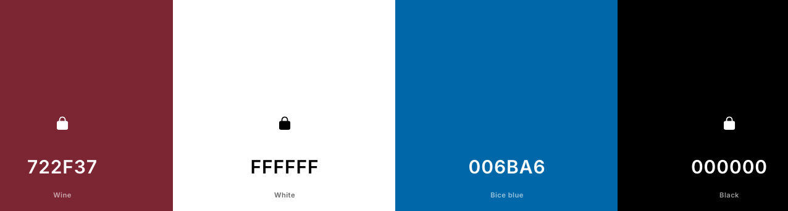
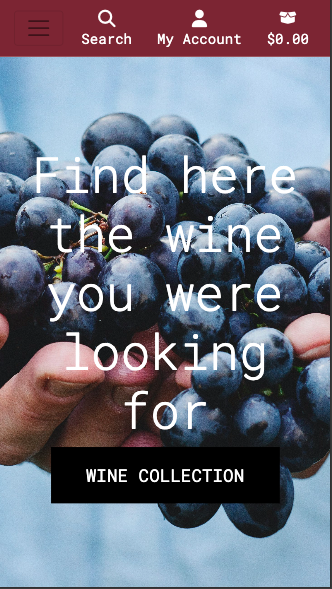
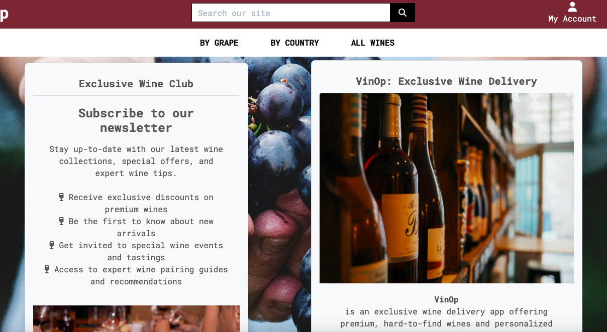
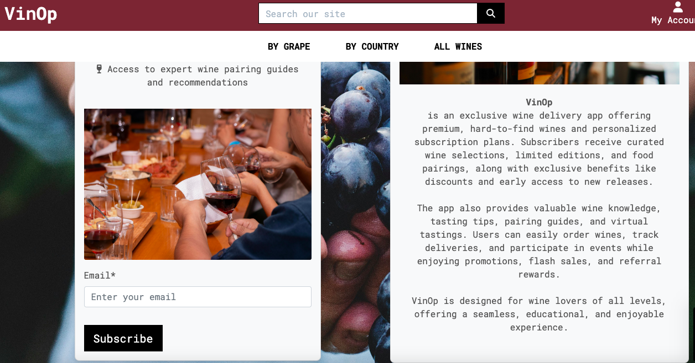
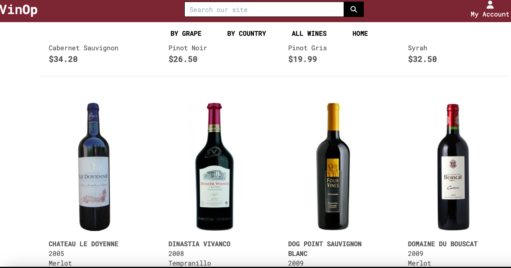
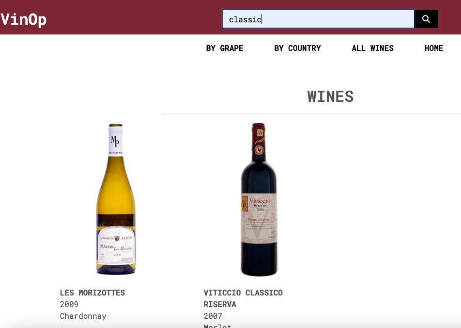
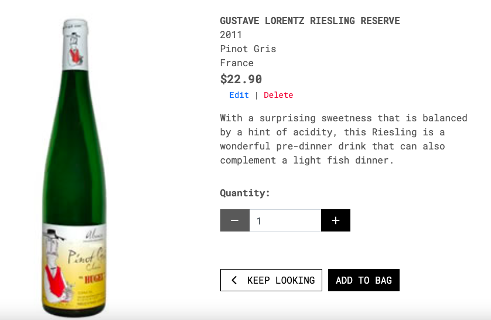
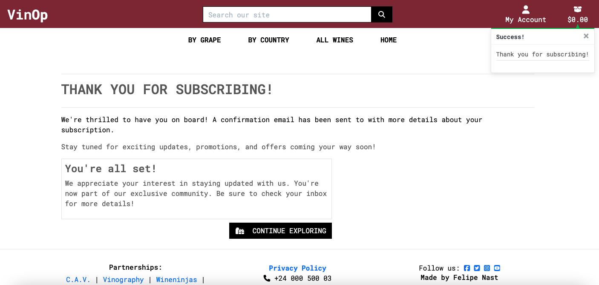

# VinOp Wine Delivery App

Visit the deployed site: https://vinop-p5-65ef4c64b7a7.herokuapp.com/

## Introduction

As a wine lover myself, I’m always eager to discover unique wines beyond the typical offerings in conventional stores, maby from small vineyards or hidden regions. A platform that connects this 2 sides, passionate wine lovers and rare vineyards would be a valuable addition to the wine community. This vision inspired me to create this project as if I were building it for myself and others who share this passion for discovering exceptional wines.

This project envisions an e-commerce platform tailored for a B2C audience, designed to foster a community of wine lovers and enthusiasts. By offering a seamless, user-friendly experience, our online wine shop enables customers to quickly find and purchase niche wines with ease. The platform’s streamlined UX prioritizes speed and simplicity, allowing users to discover, select, and order their favorite wines in just a few clicks. Beyond sales, our goal is to build a community around wine culture—sharing knowledge, insights, and stories that connect each customer to the wines they enjoy. This blend of efficiency and cultural engagement sets our shop apart, making it a destination not just for buying, but for belonging.

## Development

### Proposal

I initially entered the wine color into a palette mixer software, which revealed a light blue shade that paired beautifully with the default black and white planned for the project. The combination of red, white, and blue immediately evoked the colors of the French flag, a well-known symbol of a prominent wine-producing country. This led to the decision to use a blue-focused background image on the homepage.

Thus, the choice for a homepage background became clear: a blue-focused image that aligns with the black and white design elements, creating an ambiance that is both visually cohesive and culturally resonant. This color scheme not only grounds the site in elegance but also gives visitors an intuitive association with the tradition and quality embedded in the wine world.

The initial stage of planning the project was done on paper and divided into phases. While this layout was not the final design, it served as the proposed blueprint for the entire project interface, and how I tracked progress during development.

#### 1. Define Models for Key Entities
The first step is to identify and define the key data entities necessary for the e-commerce app:

- **Wine Model:** This model will represent each wine product, with attributes such as name, description, type, price, image and any other relevant information.
- **Subscription Model (not fully implemented):** This model will manage wine subscription options, including subscription frequency (monthly, quarterly), price, and access to a newsletter with special offers.
- **Order Model:** Used for managing customer orders, including fields for order items, total price and payment details.
- **Customer Model (User Profile):** Extend the Django User model with a OneToOneField to include additional customer information, such as address, subscription status, and preferences.

#### 2. User Authentication and Subscriptions

- **User Registration and Authentication:** Implement `django-allauth` to handle user registration, login, and password management, providing a smooth authentication process for customers.
- **Subscription Management (not implemented):** 
    - Provide customers with the option to subscribe to curated wine selections at regular intervals.
    - Allow users to select, manage, and modify their subscription plans through dedicated views.
    - Integrate recurring payments via payment gateways with Stripe to automate the subscription billing process.

#### 3. E-commerce Functionality

- **Product Catalog:**
    - Create views for listing available wines and a detailed view for each product.
    - Implement filtering options (e.g., wine type, region) to help users browse and discover wines according to their preferences.
- **Shopping Cart:**
    - Enable users to add wines to their cart, adjust quantities, and view the subtotal of their order.
    - Provide a straightforward way for users to proceed to checkout and complete their purchase.
- **Checkout and Payments:**
    - Integrate a payment gateway (Stripe) for processing payments securely.
    - Upon successful payment, create an Order instance and notify the system of the successful transaction.

#### 4. Order Fulfillment and Notifications

- **Order Tracking:** Allow users to view their order history and manage their account preferences.
- **Email Notifications:** Implement automatic email notifications for order confirmations.
- **Delivery Information:** Collect and store delivery addresses, allowing customers to track their orders.

### Agile

#### **User-Centric Stories**

- **Browse Wines:**  
  *"As a user i want to browse a selection of wines so I can explore what’s available."*

- **Wine Details:**  
  *"As a user i want to view detailed information about each wine so I can make an informed choice."*

- **Filter and Search:**  
  *"As a user i want to filter wines by type and region to find what suits my preferences."*

- **Subscription Options:**  
  *"As a user i want to see different subscription plans so I can choose the one that fits my needs."*

- **Subscribe to a Plan:**  
  *"As a user i want to subscribe to a wine plan so I receive curated wines and offers at my chosen frequency."*

- **Add to Cart:**  
  *"As a user i want to add wines to a shopping cart so I can buy multiple items at once."*

- **Review Cart:**  
  *"As a user i want to view and edit my cart before proceeding to checkout."*

- **Checkout and Payment:**  
  *"As a user i want to securely pay for my order and receive a confirmation."*

- **Order History:**  
  *"As a user i want to see my previous orders so I can track what I’ve purchased."*

- **Manage Subscription:**  
  *"As a user i want to manage my subscription plans"*

- **Receive Order Confirmation:**  
  *"As a user i want an email confirmation after each purchase so I know my order went through."*

- **User Profile:**  
  *"As a user i want to manage my account details and address for delivery purposes."*

#### **Admin-Centric Stories**

- **Manage Products:**  
  *"As an owner i want to add, edit, or remove wines in the catalog."*

- **Order Management:**  
  *"As an owner i want to view and manage customer orders to ensure smooth delivery."*

- **Send Promotions:**  
  *"As an owner i want to send promotional emails to users to encourage more subscriptions and purchases."*

https://github.com/users/fenasti/projects/4

## Features

### App Structure Overview

| **App**             | **Purpose**                                           | **Core Models**              | **Key Functionalities**                         |
|---------------------|-------------------------------------------------------|------------------------------|-------------------------------------------------|
| **Wines**           | Manages wine catalog                                  | `Wine`          | Browse wines, filter by category or grape type  |
| **Subscriptions**   | Handles subscription and storage emails     | `Subscription` | Subscription to newsletter      |
| **Bag**            | Manages user cart functionality                       | N/A (session-based)          | Add to cart, view cart, update quantity         |
| **Checkout**        | Processes payments and manages orders                 | `Order`, `OrderItem` | Order creation, payment processing            |
| **Profiles**        | Manages user profiles and authentication              | `UserProfile`                | User registration, order history |
| **Home**      | Renders home-page |  | Displays email subscription form and main content |

### Home

The homepage features the main image with a direct link to the full wine selection. At the bottom, there are two cards: one with a subscription form for the newsletter and the other providing information about the site.

### All wines

Displays all wines in the database, with sorting functionality and the ability to show search results on the same page.

### Wine details

Renders the specific wine selected by clicking the image, showing more details, a description, and the option to add it to the bag.

### Subscription

The approval of the reservation is made by the admin in the adminpage by the checklist approved model field and it shows the reservation now without the fade class. The metadata in the **ReservationRequest** model gives all the neccesary information to contact the client back and to schedule the requested datetime.

I decided to use the Comment model's base relationship from the walkthrough blog project and adapt it to only display reservations to the logged-in user. Permission for editing and deleting reservations is also restricted to users, and these actions are only possible if the user is logged in.

| Field             | Type                 |
|:-----------------:|:--------------------:|
| client            | ForeignKey(User)     |
| email             | EmailField           |
| details           | TextField            |
| reservation_date  | DateField            |
| reservation_time  | TimeField            |
| created_on        | DateTimeField        |
| approved          | BooleanField         |

The only relation is with the user that is named as client, if this is deleted, all the reservations related to the client will be erased on cascade  afterwards.

## Technologies

### Programming Languages and Frameworks

- [HTML](https://developer.mozilla.org/en-US/docs/Web/HTML)
- [CSS](https://developer.mozilla.org/en-US/docs/Learn/Getting_started_with_the_web/CSS_basics)
- [Python](https://en.wikipedia.org/wiki/Python_(programming_language))
- [Django](https://www.djangoproject.com/)
- [Bootstrap](https://getbootstrap.com/)

### Main packages in the requirements.txt file

- Cloudinary: used for managing media (like images) in Django projects.

- Dj-database-url: used for deployment to Heroku.

- Django-allauth: An app for handling user authentication, registration, account management, and logins.

- Django-crispy-forms: A Django package that helps with creating dynamic and styled forms

- Django-summernote: Editor for the Django admin that allows rich-text editing.

- Gunicorn: Python translator for running Django applications in production environments.

- Psycopg: A PostgreSQL adapter for Python, allowing Django to interact with a PostgreSQL database.

- Whitenoise: A middleware that helps serve static files directly from Django in production environments like Heroku.

## Testing

Please refer to [TESTING.md](TESTING.md)

## Problems / Bugs

### #1
The first problem i had after trying the early deploymnet was that i was using the wrong name project in the Procfile. I was using a previous project name as a copy-paste way without realizing the importance of the path

### #2
After installing Postgress and migrate the changes of the first model formulated, i faced another bug wich took me a lot of time to solve, until i added the 8000 port to the CSRF_TRUSTED_ORIGINS besides the ALLOWED_HOSTS.

### #3
When creating the superuser and migrate the first modelof Django, I deployed the project to Heroku and an "Internat Server Error" was shown. I solved it providing a SECRET_KEY variable to the Vars settings in Heroku.

### #4
I couldn't visualize the view of my Home model, this was because the template provided in the class view of the index app was not written as a relative path.

### #5
After a whole day trying to implement the callendar input i decided to come back to the main stage using the command **"git log"** to view my later logs and as i didn't commit during the whole time because there were no succesfull stages, i used the command **"git checkout --."** and came back to the previous stage.
First i tried to use an extension called Tempus Dominus but it was too complicated to install thru all the JavaScript and all the metadata needed. The main problem was that afer to be able to show a callendar input, the data was given all date and time together and somehow the default format couldn't accept it in any way i tried, even changing the default format to many different acceptance criterias.
After returning to the previous stage i decided to separate the specifications input to both time and date respectively separated and combine them afterwards to use them as the database reservation_datetime object required.

## Future implementations

As shown in my Agile project board there were 3 functions that were way out of my knowledge to implement.

- An automatic response when the reservation is possible due a callendar which has all the schedulled reservations and which can provide inmediate response when a spot is free or taken.

- Email confirmation with an autogenerated template with the details of the reservation that is sended to the client mail adress.

- A Google maps API that shows the exact location of the restaurant in the about page.

## Deployment

- Installing the requiremnts packages like gunicorn and whitenoise.

- Create the Heroku app and link it to the github repository.

- Add heroku to ALLOWED_HOST and the packages as middelware.

- Create the Procfile.

- Add any variable required in the var setting in Heroku as the password or the postgress url.

- Use collect static for deployments when debug is set to False.

- Manually deploy from the branch in the Deploy link from the app.

## Credits

### Tutorials

- https://www.youtube.com/watch?v=pEwA4-Mmnj8

- https://djangotricks.blogspot.com/2019/10/working-with-dates-and-times-in-forms.html

- https://getbootstrap.com/docs/5.3/getting-started/introduction/
Basically all the documentation created by the Bootstrap comunity is very useful and gentle for the user.

### Inspirational projects

- https://github.com/kera-cudmore/TheQuizArms?tab=readme-ov-file#testing

- https://github.com/markdaniel1982/MD82-P4/tree/main

- Of course the Codestar Blog project provided by Code Institute wich was very fun to make and understand.

- https://crumber.com
I'm not quite sure how I came across this webpage, but its simplicity served as great inspiration for the design of this project.

- https://www.rolls-berlin.de
An example of a real restaurant webpage, as a curious fact i worked with the owners of this business and they are beautiful people and they serve delicious food.

