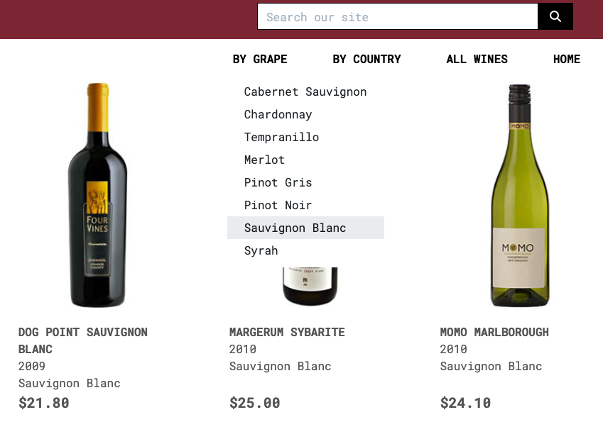
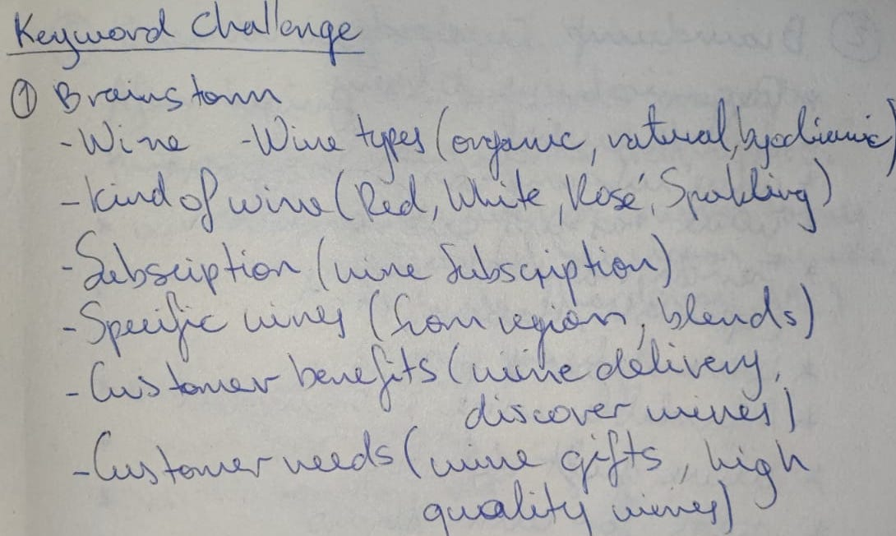

# VinOp Wine Delivery App

Visit the deployed site: https://vinop-p5-65ef4c64b7a7.herokuapp.com/

## Introduction

As a wine lover myself, I’m always eager to discover unique wines beyond the typical offerings in conventional stores, maby from small vineyards or hidden regions. A platform that connects this 2 sides, passionate wine lovers and rare vineyards would be a valuable addition to the wine community. This vision inspired me to create this project as if I were building it for myself and others who share this passion for discovering exceptional wines.

This project envisions an e-commerce platform tailored for a B2C audience, designed to foster a community of wine lovers and enthusiasts. By offering a seamless, user-friendly experience, our online wine shop enables customers to quickly find and purchase niche wines with ease. The platform’s streamlined UX prioritizes speed and simplicity, allowing users to discover, select, and order their favorite wines in just a few clicks. Beyond sales, our goal is to build a community around wine culture—sharing knowledge, insights, and stories that connect each customer to the wines they enjoy. This blend of efficiency and cultural engagement sets our shop apart, making it a destination not just for buying, but for belonging.

## Development

### Proposal

I initially entered the wine color into a palette mixer software, which revealed a light blue shade that paired beautifully with the default black and white planned for the project. The combination of red, white, and blue immediately evoked the colors of the French flag, a well-known symbol of a prominent wine-producing country. This led to the decision to use a blue-focused background image on the homepage.

Thus, the choice for a homepage background became clear: a blue-focused image that aligns with the black and white design elements, creating an ambiance that is both visually cohesive and culturally resonant. This color scheme not only grounds the site in elegance but also gives visitors an intuitive association with the tradition and quality embedded in the wine world.

The initial stage of planning the project was done on paper and divided into phases. While this layout was not the final design, it served as the proposed blueprint for the entire project interface, and how I tracked progress during development.

#### 1. Define Models for Key Entities
The first step is to identify and define the key data entities necessary for the e-commerce app:

- **Wine Model:** This model will represent each wine product, with attributes such as name, description, type, price, image and any other relevant information.
- **Subscription Model (not fully implemented):** This model will manage wine subscription options, including subscription frequency (monthly, quarterly), price, and access to a newsletter with special offers.
- **Order Model:** Used for managing customer orders, including fields for order items, total price and payment details.
- **Customer Model (User Profile):** Extend the Django User model with a OneToOneField to include additional customer information, such as address, subscription status, and preferences.

#### 2. User Authentication and Subscriptions

- **User Registration and Authentication:** Implement `django-allauth` to handle user registration, login, and password management, providing a smooth authentication process for customers.
- **Subscription Management (not implemented):** 
    - Provide customers with the option to subscribe to curated wine selections at regular intervals.
    - Allow users to select, manage, and modify their subscription plans through dedicated views.
    - Integrate recurring payments via payment gateways with Stripe to automate the subscription billing process.

#### 3. E-commerce Functionality

- **Product Catalog:**
    - Create views for listing available wines and a detailed view for each product.
    - Implement filtering options (e.g., wine type, region) to help users browse and discover wines according to their preferences.
- **Shopping Cart:**
    - Enable users to add wines to their cart, adjust quantities, and view the subtotal of their order.
    - Provide a straightforward way for users to proceed to checkout and complete their purchase.
- **Checkout and Payments:**
    - Integrate a payment gateway (Stripe) for processing payments securely.
    - Upon successful payment, create an Order instance and notify the system of the successful transaction.

#### 4. Order Fulfillment and Notifications

- **Order Tracking:** Allow users to view their order history and manage their account preferences.
- **Email Notifications:** Implement automatic email notifications for order confirmations.
- **Delivery Information:** Collect and store delivery addresses, allowing customers to track their orders.

### Agile

#### **User-Centric Stories**

- **Browse Wines:**  
  *"As a user i want to browse a selection of wines so I can explore what’s available."*

- **Wine Details:**  
  *"As a user i want to view detailed information about each wine so I can make an informed choice."*

- **Filter and Search:**  
  *"As a user i want to filter wines by type and region to find what suits my preferences."*

- **Subscription Options:**  
  *"As a user i want to see different subscription plans so I can choose the one that fits my needs."*

- **Subscribe to a Plan:**  
  *"As a user i want to subscribe to a wine plan so I receive curated wines and offers at my chosen frequency."*

- **Add to Cart:**  
  *"As a user i want to add wines to a shopping cart so I can buy multiple items at once."*

- **Review Cart:**  
  *"As a user i want to view and edit my cart before proceeding to checkout."*

- **Checkout and Payment:**  
  *"As a user i want to securely pay for my order and receive a confirmation."*

- **Order History:**  
  *"As a user i want to see my previous orders so I can track what I’ve purchased."*

- **Manage Subscription:**  
  *"As a user i want to manage my subscription plans"*

- **Receive Order Confirmation:**  
  *"As a user i want an email confirmation after each purchase so I know my order went through."*

- **User Profile:**  
  *"As a user i want to manage my account details and address for delivery purposes."*

#### **Admin-Centric Stories**

- **Manage Products:**  
  *"As an owner i want to add, edit, or remove wines in the catalog."*

- **Order Management:**  
  *"As an owner i want to view and manage customer orders to ensure smooth delivery."*

- **Send Promotions:**  
  *"As an owner i want to send promotional emails to users to encourage more subscriptions and purchases."*

https://github.com/users/fenasti/projects/4

## Features

### App Structure Overview

| **App**             | **Purpose**                                           | **Core Models**              | **Key Functionalities**                         |
|---------------------|-------------------------------------------------------|------------------------------|-------------------------------------------------|
| **Wines**           | Manages wine catalog                                  | `Wine`          | Browse wines, filter by category or grape type  |
| **Subscriptions**   | Handles subscription and storage emails     | `Subscription` | Subscription to newsletter      |
| **Bag**            | Manages user cart functionality                       | N/A (session-based)          | Add to cart, view cart, update quantity         |
| **Checkout**        | Processes payments and manages orders                 | `Order`, `OrderItem` | Order creation, payment processing            |
| **Profiles**        | Manages user profiles and authentication              | `UserProfile`                | User registration, order history |
| **Home**      | Renders home-page |  | Displays email subscription form and main content |

### Home

The homepage features the main image with a direct link to the full wine selection. At the bottom, there are two cards: one with a subscription form for the newsletter and the other providing information about the site.

### All wines

Displays all wines in the database, with sorting functionality and the ability to show search results on the same page.

### Wine details

Renders the specific wine selected by clicking the image, showing more details, a description, and the option to add it to the bag.

### Subscription

Shows a subscription success page after submiting the form outlining the benefits of subscribing, and automatically sends a confirmation email to the provided address.

### Checkout

The checkout page is accessed from the bag contents and provides all the necessary functionalities for a quick payment via Stripe. Upon completion, it generates the order, associates it with the user profile (if available), and stores it in the database. Additionally, a confirmation email is automatically sent to the client.

### Footer

Displays information about the associated partners, details from the owners, a link to the site’s policies, and links to social media.

### Profile

On the profile page, the user can view their shipping details, details of previous orders, and access all sign-in, login, and other authentication features provided by django-allauth.

Additionally, if the user is authenticated as a superuser, they have direct access to all CRUD functionality from the webpage.

### Error

A custom error handler is implemented for all errors recognized by Django, ensuring that the webpage doesn’t crash due to URL misdirection.

## Technologies

### Programming Languages and Frameworks

- [HTML](https://developer.mozilla.org/en-US/docs/Web/HTML)
- [CSS](https://developer.mozilla.org/en-US/docs/Learn/Getting_started_with_the_web/CSS_basics)
- [Python](https://en.wikipedia.org/wiki/Python_(programming_language))
- [Django](https://www.djangoproject.com/)
- [Bootstrap](https://getbootstrap.com/)

### Database

All database-related media and static files are stored and managed in an AWS S3 bucket. This setup provides reliable, long-term access to the files, ensuring they are securely hosted and easily accessible for the application.

### Main packages in the requirements.txt file

- Dj-database-url: used for deployment to Heroku.

- Django-allauth: An app for handling user authentication, registration, account management, and logins.

- Django-crispy-forms: A Django package that helps with creating dynamic and styled forms

- Boto3: Allowing the application to interact with AWS services like S3 for file storage.

- Pillow: A Python Library that allows image processing within Django applications.

- Gunicorn: Python translator for running Django applications in production environments.

- Psycopg: A PostgreSQL adapter for Python, allowing Django to interact with a PostgreSQL database.

- Stripe: Enable payment processing for purchases.

## Testing

Please refer to [TESTING.md](TESTING.md)

## Problems / Bugs

### Bug 1

During development, I implemented some aesthetic features that unexpectedly caused the page to render incorrectly. The layout appeared broken, as if the CSS were only partially applied. After extensive debugging and even rolling back recent commits, suspecting I had broken the display, I still couldn’t find the issue. Finally, I opened the project in Opera and saw everything displaying correctly. Realizing it was a cache issue, I cleared the cached files from Google Chrome, and the page appeared as intended.

### Bug 2

The media files weren’t loading from AWS, so I reached out to my tutor for assistance. Together, we investigated and eventually realized the issue was due to incorrect permissions settings. I decided it would be best to start from scratch. During the process, I discovered that I hadn’t enabled public access for the created users, which was causing the problem.

## Future implementations

- Create various paid subscription options offering benefits for different durations and price levels.
  
- Allow registered users to rate wines, with ratings displayed as a feature on each wine.

- Provide a personalized wine list based on each user’s order history.

## Deployment

- Installing the requiremnts packages like gunicorn and whitenoise.

- Create the Heroku app and link it to the github repository.

- Add heroku to ALLOWED_HOST and the packages as middelware.

- Create the Procfile.

- Add any variable required in the var setting in Heroku.

- Use collect static for deployments when debug is set to False.

- Manually deploy from the branch in the Deploy link from the app.

## Marketing

### Keyword Challenge

The implementation of SEO was foundational to the creation of this project. Through the keyword challenge, I defined the concepts and content the application needed to include, and from there, I began planning all the processes. SEO is present in:

- Meta Tags in `base.html`: Include well-defined meta tags, specifically *keywords* and *description*, to improve SEO and provide search engines with relevant content descriptions.

- Descriptive Title: Use a precise and descriptive title that clearly reflects the page’s content, making it easily identifiable and appealing in search engine results.

- Strategic Use of Keywords: Select and integrate relevant keywords throughout the content elements of the project to optimize for search engine relevance.

- Addition of External Links: Incorporate links to reputable, established websites related to the world of wine to enhance credibility and provide users with valuable resources.

- Alt Attributes for Images: Implement "alt" attributes on all images, both to improve accessibility for users and to enhance SEO by providing search engines with context about the visual content.

- Inclusion of `robots.txt` and `sitemap.xml` Files: Add `robots.txt` and `sitemap.xml` files at the root level of the project to guide search engine crawlers effectively and ensure all important pages are indexed.

#### 1. Who Are Your Users?

   - **Wine Enthusiasts**: People who are passionate about wine and want to explore unique varieties.
   - **Gift Shoppers**: Users looking to gift a subscription or unique wine selection.
   - **Eco-Conscious Shoppers**: Consumers interested in biodynamic, organic, and natural wines.
   - **Busy Professionals**: Individuals who value convenience and appreciate curated experiences.
   - **Beginner Wine Drinkers**: Those interested in learning about wine but unsure where to start.

#### 2. Which Online Platforms Would You Find Lots of Your Users?

   - **Instagram**: Wine imagery and food-pairing posts perform well here. It’s visual and allows to showcase the lifestyle element.
   - **Facebook**: Useful for a slightly older demographic.
   - **YouTube**: Ideal for sharing educational content about wine selection, pairing, and tasting tips.
   - **Pinterest**: Many users search here for wine-pairing ideas, gift options, and lifestyle content.

#### 3. Would Your Users Use Social Media? If Yes, Which Platforms Do You Think You Would Find Them On?

   - **Instagram and Pinterest** for visual appeal and lifestyle content.
   - **YouTube** for educational wine content and wine tasting.
   - **Facebook** for targeted ads and community-driven approach, including wine interest groups.

#### 4. What Do Your Users Need? Could You Meet That Need with Useful Content? If Yes, How Could You Best Deliver That Content to Them?

   - **Wine Education**: Beginners and enthusiasts alike appreciate wine-tasting tips, food pairings, and information on organic/biodynamic wines.
   - **Discovery of New Wines**: Users want to know they’re trying unique or quality selections not found in local stores.
   - **Convenient Purchasing Options**: Subscriptions with flexible delivery times and personalized choices.
   - **Blog Articles**: Create blog posts on topics like “Top Biodynamic Wines Explained” or “How to Taste Wine Like a Sommelier.”
   - **Social Media Posts**: Share wine-pairing ideas, looks at vineyards and customer stories.
   - **Email Newsletters**: “Wine of the Month” highlights", tips and exclusive subscriber-only content.
   - **Educational YouTube Videos**: Short videos explaining topics.

#### 5. Would Your Business Run Sales or Offer Discounts? How Do You Think Your Users Would Most Like to Hear About These Offers?

   - **Email Newsletters**: Use these for exclusive subscriber discounts, seasonal offers, or special holiday promotions.
   - **Social Media Announcements**: Post about discounts on Instagram and Facebook, where they’re easy to share.
   - **Website Pop-Up or Banner**: Include a pop-up on your landing page promoting limited-time discounts.
   - **Loyalty Program or Referral Discounts**: Consider offering discounts to users who refer friends or who consistently order.

#### 6. What Are the Goals of Your Business? Which Marketing Strategies Would Offer the Best Ways to Meet Those Goals?

   - **Building Brand Awareness**: Create a presence on social media, focusing on customer engagement.
   - **Growing Subscriptions**: Use targeted ads, email marketing, and referral incentives to attract subscribers.
   - **Positioning as an Authority in Wine**: Publish expert content, collaborate with sommeliers, and partner with reputable wine influencers or blogs.
   - **Content Marketing**: Focus on SEO-optimized blog posts and educational social media content.
   - **Email Marketing**: Regular, value-added newsletters with wine tips, discounts, and referral bonuses.
   - **Influencer Partnerships**: Work with wine influencers or bloggers for authentic reviews or unboxings.
   - **Paid Ads**: Consider Facebook and Instagram ads, targeting users with interests in wine or gourmet products.

#### 7. Would Your Business Have a Budget to Spend on Advertising? Or Would It Need to Work with Free or Low-Cost Options to Market Itself?

   - **Low Budget**: Focus on organic reach through SEO, blog content, social media engagement, and email newsletters.
   - **Moderate Budget**: Use targeted ads on Instagram and Facebook. Run seasonal campaigns.
   - **Higher Budget**: Consider Google Ads for keywords like “wine subscription” or “unique wines delivered.” Invest in high-quality video content or branded collaborations.

## Credits

I reused some code snipets of Boutique-Ado and my previous project Flamingo Terrace.

### Inspirational projects

- https://github.com/kera-cudmore/TheQuizArms?tab=readme-ov-file#testing

- https://github.com/pauline-rugwevera/ecommerce-pp5/blob/main/README.md

- Of course the Boutique-Ado project provided by Code Institute.

- https://cav.cl/
An established online shop pioneering wine subscriptions, offering various subscription options that include curated wine boxes along with one of the most renowned gourmet magazines in Chile.

- https://winebox.es/