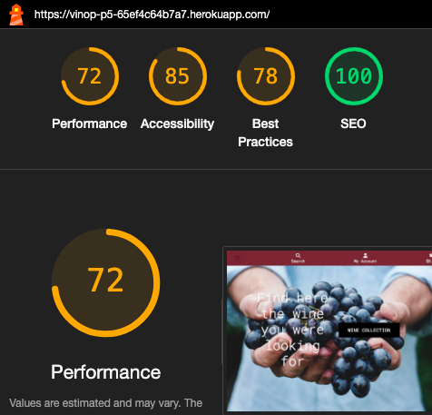
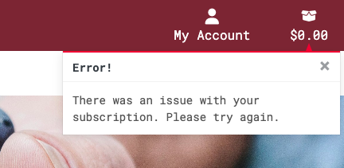

# VinOp - Testing

Visit the deployed site: https://vinop-p5-65ef4c64b7a7.herokuapp.com/

## Automated testing

### Lighthouse 

Lighthouse testing showed relatively average performance optimization due to the cross-database located in AWS. On the other hand, all SEO implementations were highly considered and well-executed.

### Python

[ CI Python linter ](https://pep8ci.herokuapp.com/) was used to test python code

- No error besides variables longer than 79 caracters, non longer than 99.

## Manual Testing

### Admin

| Feature         | Test                         | Expected Result                                     | Actual Result |
|-----------------|------------------------------|-----------------------------------------------------|---------------|
| Add Wines       | Adding a new wine product     | Successfully adds wine and displays it in catalog  | Pass          |
| Edit Wines      | Editing a wine product       | Successfully edits the wine and updates catalog    | Pass          |
| Delete Wines    | Deleting a wine product      | Successfully deletes wine from catalog             | Pass          |
| Access Admin Page | Accessing the admin page   | Successfully directs user to the admin interface   | Pass          |
| View Orders     | Viewing order details        | Successfully displays order details for review     | Pass          |

### User

| Feature                    | Test               | Expected Result                 | Actual Result           |
|----------------------------|-------------------|----------------------------------|-------------------------|
| Browse Wines       | Viewing wine list        | Displays a curated list of available wines to browse   | Pass          |
| Wine Details   | Viewing individual wine details   | Shows detailed information about selected wine (name, description, price) | Pass   |
| Filter Wines   | Using the filter options    | Filters wines by type, region, or price and displays results | Pass    |
| Add to Cart  | Adding wine to cart    | Successfully adds the selected wine to the shopping cart  | Pass    |
| View Cart   | Viewing cart         | Displays the selected wines, their quantities, and total price | Pass       |
| Edit Cart        | Changing quantities in cart    | Updates cart with new quantity and adjusts the total price | Pass   |
| Checkout  | Proceeding to checkout  | Directs to the checkout page with payment and shipping options | Pass      |
| Payment  | Completing the payment    | Successfully processes payment and directs to order confirmation page |Pass          |
| Order Confirmation  | Receiving order confirmation  | User receives email confirmation with order details   | Pass |
| Track Orders   | Viewing order status     | Allows the user to track the status of their order   | Pass     |
| Manage Newsletter Subscription  | Subscribing to the newsletter  | User can subscribe to the newsletter and receive updates | Pass   |
| Newsletter unsubscribe | Unsubscribing to the newsletter  | User cant unsubscribe from the newsletter manually | Fail   |
| User Profile    | Viewing user profile     | Displays user information and past orders       | Pass          |

### Links testing

| Feature  | Test      | Expected Result   | Actual Result |
|--------|-----------------|-----------------|------------|
| Home      | Home link redirects to home page       | Link works as intended   | Pass       |
| Logo    | Logo link redirects to home page        | Link works as intended   | Pass      |
| Log Out    | Log Out link redirects to sign out page | Link works as intended   | Pass       |
| Sign Out     | Sign Out button redirects to home page  | Button works as intended | Pass      |
| Login     | Login link redirects to login page      | Link works as intended   | Pass       |
| Sign In    | Sign In button redirects to home page   | Button works as intended | Pass       |
| Sign Up   | Sign Up button redirects to home page   | Button works as intended | Pass      |
| Register   | Register link redirects to sign up page | Link works as intended  | Pass     |
| Add Wine to Cart| Add wine button adds wine to cart       | Wine successfully added to| Pass    |
| View Cart | View cart redirects to cart page        | Cart page displayed correc| Pass      |
| Remove Wine from Cart  | Remove wine button removes wine from cart   | Wine successfully removed from cart  | Pass  |
| Checkout | Checkout button redirects to checkout page        | Checkout page displayed correctly    | Pass   |
| Payment  | Payment form processes payment successfully | Payment successfully processed       | Pass     |
| Order Confirmation  | Order confirmation redirects to confirmation page | irmation displayed correctly  | Pass       |
| Order History| View order history shows past orders        | Past orders displayed correctly   | Pass   |
| Subscription  | Newsletter subscription form subscribes user| Subscription successfully added     | Pass    |
| Wine Filter| Filter wines by type or regi    | Wines filtered correctly based on selected criteria  | Pass   |
| Wine Details| View wine details displays full wine information | Product details displayed correctly   | Pass       |
| Social Media | Social media icons redirect to correct profiles| Icons redirect to correct social media pages|Pass  |
| Footer | Footer links redirect to privacy policy and other pages  | Links work as intended  | Pass      |

## Error handling

- When there is an error a modal is displayed with the error message.

- When an user enters manually or inderectly to a non existing or broken url a custom error webpage is shown.

## Testing was performed on the following devices:

* Laptop:
  * Macbook Air 2018
* Mobile Devices:
  * iPhone 13 pro
  * Xiaomi 11T pro

## Each device tested the site using the following browsers:

* Google Chrome
* Safari
* Firefox